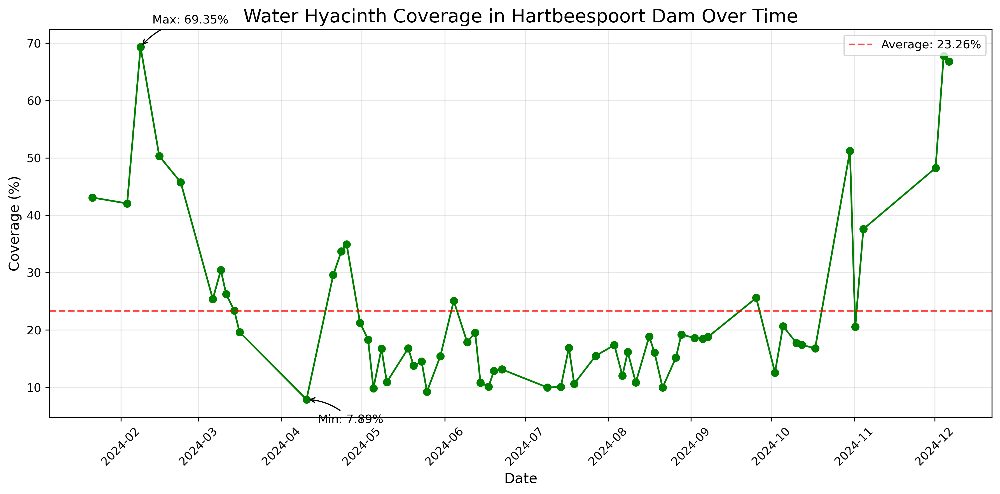

# Using Sentinel-2 Data from the AWS Open Data Project to measure water hyacinth growth

(Copernicus Sentinel data 2023)

## Background
Hartbeespoort Dam is located in South Africa's North West Province. The dam has been plagued by uncontrolled water hyacinth growth since the 1970s. At times, water hyacinth covers 60% of the dam surface area. Several remediation projects have tried to address the problem. The water hyacinth causes toxic algal blooms that affect bird and animal life, and present a risk to human health. 

The Mail and Guardian newspaper published [an article](https://mg.co.za/the-green-guardian/2023-11-12-tiny-planthoppers-reduce-invasive-water-hyacinth-on-hartbeespoort-dam-to-5/) about the use of a "planthopper" insect to control the spread of the weed, but success has been limited.

Monitoring recent and historic hyacinth growth can raise awareness of the risks and contribute to remediation planning. Data from the Sentinel-2 satellites can be used to visualise and measure the hyacinth coverage in the dam.

## This project
This project can be used to visualise water hyacinth, water lettuce or other vegetation growth in dams throughout South Africa, and with small changes, any dam where shapefiles are available. Try the notebook with other dam names, for example: Bronkhorstspruit, Sterkfontein, Loskop

## Open Data on AWS
Sentinel-2 data is available on the AWS Open Data Registry at https://registry.opendata.aws/sentinel-2/ and as Cloud Optimised GeoTiffs (COGs) at https://registry.opendata.aws/sentinel-2-l2a-cogs/. We will use the latter for this project.

## Environment setup

The environment can be set up on [SageMaker Studio Lab](https://studiolab.sagemaker.aws) using a Geodata kernel. You can register to use SageMaker Studio Lab for free, with CPU usage of up to 4 hours at a time with a limit of 8 hours in a 24-hour period or GPU for up to 4 hours at a time with a limit of 4 hours in a 24-hour period. This project only requires CPU usage. The Geodata kernel will preinstall many of the Python packages we need. You can install any extra dependencies using pip - see the Environment Setup section in the Jupyter notebook for a list of additional dependencies.

## License
Please see the License file

## Sample Output

